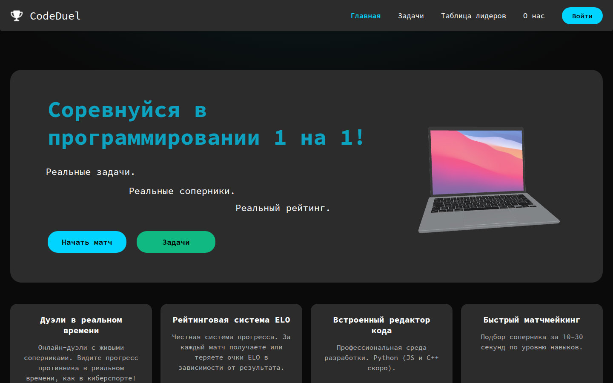
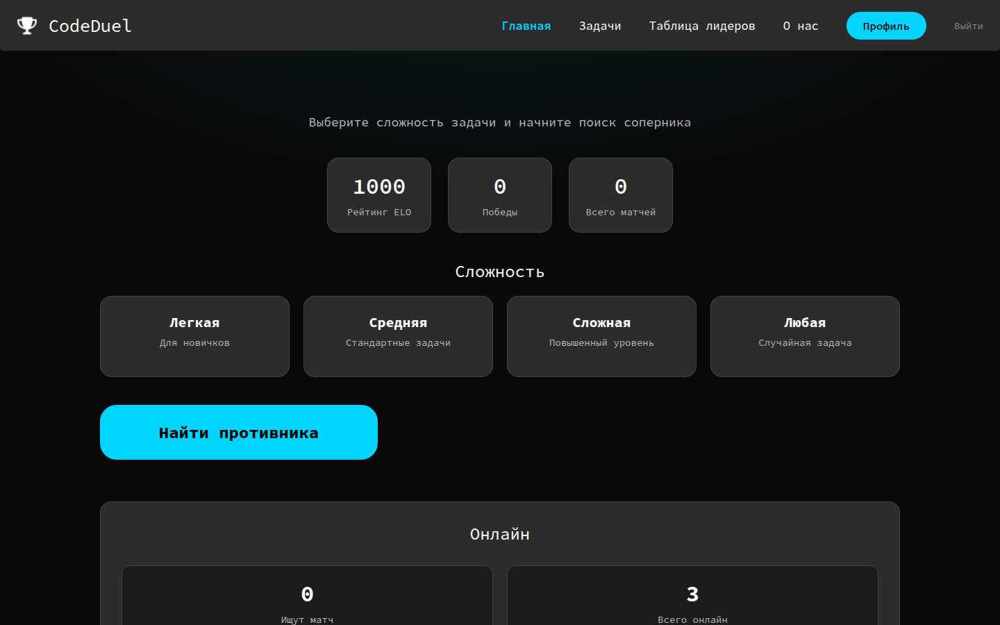
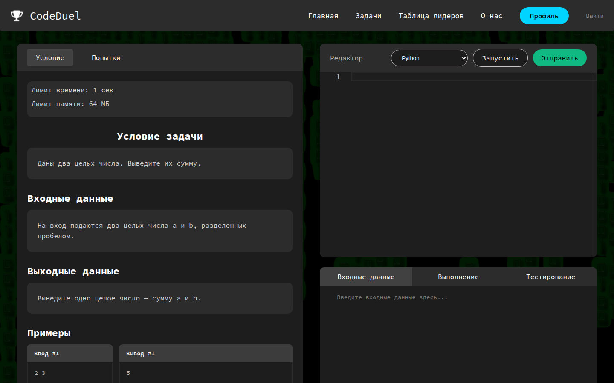

# CodeDuel

Дуэли 1 на 1 по спортивному программированию. Регистрируешься, ищешь соперника по рейтингу Elo, решаешь одну задачу на двоих в браузере. Можно и просто потренироваться в каталоге.

Пет-проект: Flask, Socket.IO, Postgres, Monaco Editor.



## Что умеет

- матчмейкинг по сложности и рейтингу (±300 Elo)
- редактор кода в браузере, прогон тестов, дуэль на время
- рейтинг Elo после матча, таблица лидеров, профиль
- выполнение чужого Python в отдельном процессе с лимитами
- гостевой аккаунт, чтобы открыть и потыкать




## Стек

| Слой | Чем |
| --- | --- |
| Backend | Flask, Flask-SocketIO, SQLAlchemy |
| Realtime | WebSocket (eventlet, один воркер) |
| БД | PostgreSQL, локально можно SQLite |
| Фронт | Jinja, Monaco, свой CSS |

## Как запустить у себя

Нужен Python 3.11+. Postgres не обязателен.

```bash
python3 -m venv venv
source venv/bin/activate   # Windows: venv\Scripts\activate
pip install -r requirements.txt
cp .env.example .env
python run_socketio.py
```

Открыть http://127.0.0.1:5000

При первом старте создаются таблицы, пачка задач и демо-аккаунт:

- логин: `demo@example.com`
- пароль: `demo123`

Если хочешь Postgres — пропиши `DATABASE_URL` в `.env`.

Тесты:

```bash
python -m unittest discover -s tests
```

## Бесплатный хостинг (Render)

Карты не просит. Бесплатный веб-сервис засыпает через ~15 минут без трафика — первый заход после сна занимает около минуты, это нормально.

Бесплатный Postgres на Render живёт **30 дней**. Для портфолио этого хватает; если нужно дольше — база на [Neon](https://neon.tech) (тоже free) и её `DATABASE_URL` в настройках сервиса.

### Шаги

1. Залей этот репозиторий на GitHub (ветку `main`, либо влей текущий PR).
2. Зайди на [render.com](https://render.com) → New → Blueprint.
3. Выбери репозиторий `codeduel`. Подхватится `render.yaml`.
4. Дождись деплоя, открой `https://codeduel-xxxx.onrender.com`.
5. Войди как `demo@example.com` / `demo123`.

Вручную, без Blueprint: New → Web Service → этот repo, build `pip install -r requirements.txt`, start `gunicorn -c gunicorn.conf.py run_gunicorn:app`, план Free. Рядом New → PostgreSQL (Free) и переменная `DATABASE_URL` из Internal Database URL. Ещё `SECRET_KEY` — Generate.

## Структура

```
create_app.py     фабрика Flask + Socket.IO
routes/           страницы, логин, матчмейкинг, сдача решений
services/         Elo, скоринг, очередь, сид демо-данных
executor/         запуск Python с лимитами
models/           пользователи, задачи, матчи
templates/        HTML
static/           CSS, шрифты, Monaco, Three.js
```

VPS с nginx — пример в `nginx.conf.example` и `deploy.sh`. Для портфолио проще Render.

## Лицензия

Для учёбы и портфолио. Задачи в сиде учебные, не из контестов.
